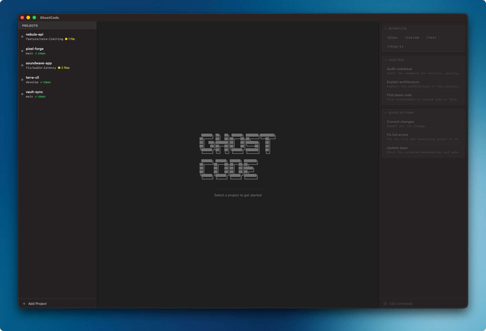
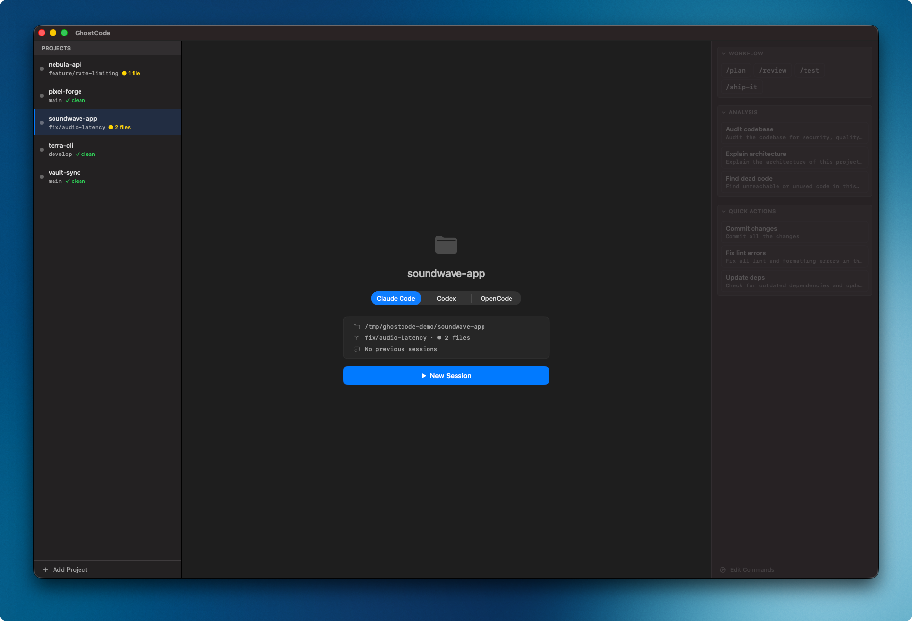
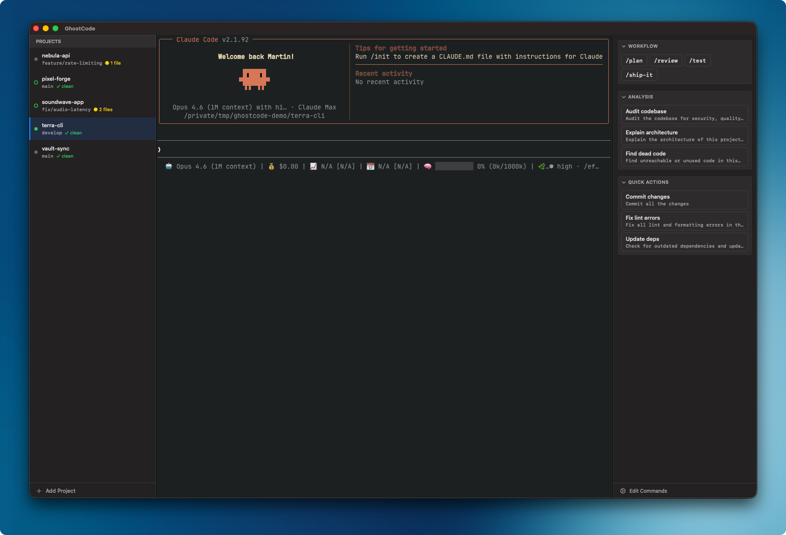
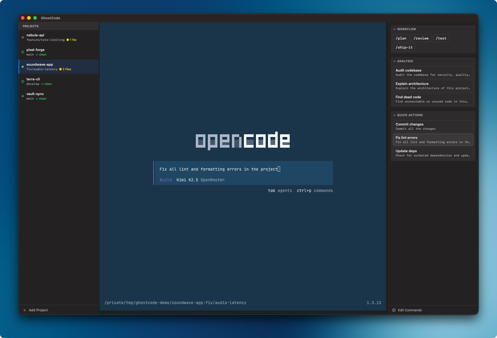

<h1>

  GhostCode
   
  macOS AI coding terminal manager based on Ghostty

</h1>

  <a href="#about">About</a>
  ·
  <a href="#features">Features</a>
  ·
  <a href="#building">Building</a>
  ·
  <a href="#license-and-attribution">License</a>

> [!IMPORTANT]
> **GhostCode is an independent, unofficial fork of [Ghostty](https://github.com/ghostty-org/ghostty) v1.3.1.**
>
> All terminal emulation is provided by Ghostty's core engine. GhostCode adds a SwiftUI application layer on top for AI coding workflows. It does not track upstream Ghostty changes.
>
> GhostCode is **not affiliated with, endorsed by, or supported by** the Ghostty project or Mitchell Hashimoto. The original Ghostty source code is licensed under the MIT License — Copyright (c) 2024 Mitchell Hashimoto, Ghostty contributors.

## About

GhostCode is a macOS-native application that wraps [Ghostty's](https://ghostty.org) terminal engine in a purpose-built interface for AI-assisted coding workflows. It provides a three-panel layout — project sidebar, terminal, and command palette — designed around managing multiple projects where each runs an AI coding assistant.

Rather than being a general-purpose terminal emulator, GhostCode is opinionated: it launches AI CLI tools ([Claude Code](https://docs.anthropic.com/en/docs/claude-code), [Codex](https://github.com/openai/codex), or [OpenCode](https://github.com/opencode-ai/opencode)) inside Ghostty-powered terminals, with project-aware context and quick-access commands alongside them.

GhostCode is **macOS only**, built entirely with SwiftUI and AppKit.

## Screenshots

|                                                          |                                                         |
| -------------------------------------------------------- | ------------------------------------------------------- |
|           |  |
| Splash screen with project list and command palette      | Project landing page with binary picker                 |
|  |    |
| Active Claude Code session                               | OpenCode session with command palette                   |

## Features

### Project Management

- Project list with live git status — branch name, dirty state, ahead/behind counts
- Per-project AI binary preference (Claude Code, Codex, or OpenCode)
- Project landing page showing session count and last-used date
- "Open With" context menu integration (VS Code, Tower)

### Terminal Sessions

- Powered by Ghostty's terminal engine (`libghostty`)
- Session resume support for Claude Code (`--continue`)
- Background session indicators (active/inactive/visible state tracking)
- Terminal exit detection with automatic return to landing page

### Command Palette

- Configurable command buttons defined in JSONC
- Flow and list layout modes with section headers
- File watcher — auto-reloads on save, no restart needed
- Tooltip support on command buttons

### Configuration

All configuration lives in `~/.config/ghostcode/`:

| File             | Purpose                                               |
| ---------------- | ----------------------------------------------------- |
| `config`         | Terminal settings, layered on top of Ghostty defaults |
| `projects.jsonc` | Project directory list                                |
| `commands.jsonc` | Command palette buttons and sections                  |

JSONC (JSON with Comments) is supported across all config files.

## Supported Binaries

| Binary      | Resume Session     | Session Info |
| ----------- | ------------------ | ------------ |
| Claude Code | Yes (`--continue`) | Yes          |
| Codex       | —                  | —            |
| OpenCode    | —                  | —            |

## Building

GhostCode requires building the Ghostty core (Zig) and then the macOS app (Xcode).

1. **Build the Ghostty core** — follow the instructions in [HACKING.md](HACKING.md) to set up the Zig toolchain and build `libghostty`.
2. **Build the macOS app** — open `macos/Ghostty.xcodeproj` in Xcode and build the **GhostCode** scheme.

The bundle identifier is `com.flydev.ghostcode`, so GhostCode can be installed alongside Ghostty without conflict.

## License and Attribution

GhostCode is a derivative work of [Ghostty](https://github.com/ghostty-org/ghostty), distributed under the **MIT License**.

The original Ghostty source code and its copyright belong to its authors:

> Copyright (c) 2024 Mitchell Hashimoto, Ghostty contributors

See the [LICENSE](LICENSE) file for the full license text.

GhostCode is **not affiliated with, endorsed by, or supported by** the Ghostty project, Mitchell Hashimoto, or any Ghostty contributors. Any issues with GhostCode should be directed to the [GhostCode repository](https://github.com/skydiver/GhostCode), not to the upstream Ghostty project.

## Acknowledgments

GhostCode exists because of the excellent work by [Mitchell Hashimoto](https://mitchellh.com) and the [Ghostty contributors](https://github.com/ghostty-org/ghostty). Thank you for building a fast, native, and well-architected terminal emulator.
